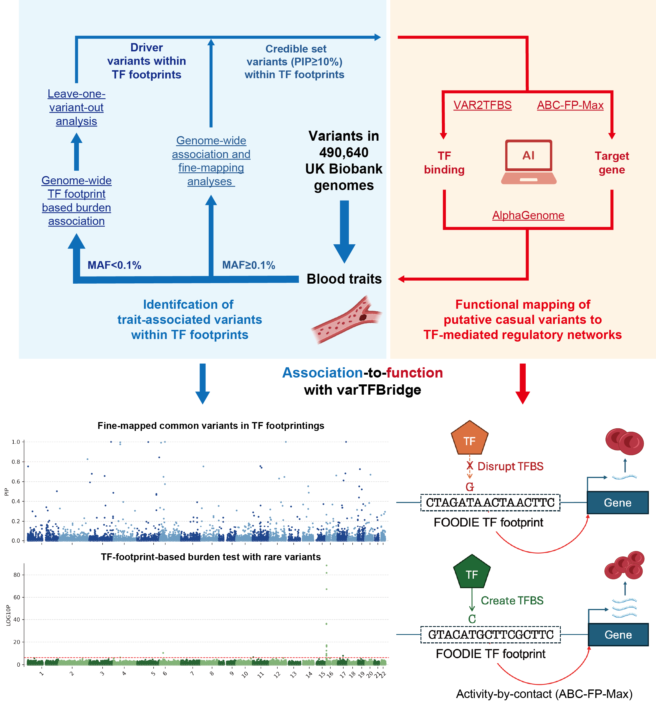

# varTFBridge: genome-wide maps of transcription factor footprints identify noncoding variants rewiring gene regulatory networks

<p align="center">
  
</p>

**varTFBridge** is an integrative framework that combines transcription factor (TF) footprinting data with genome-wide association analyses to identify causal noncoding variants and elucidate their regulatory mechanisms in TF-mediated gene regulation.

## Overview

Common-variant genome-wide association studies have identified thousands of noncoding loci associated with human diseases and complex traits; however, interpreting their functional mechanisms remains a major challenge. varTFBridge addresses this by:

- Leveraging high-resolution FOODIE (single-molecule deaminase footprinting) TF footprints
- Integrating both common and rare variant association analyses
- Employing footprint-gene linking models (ABC-FP-Max)
- Utilizing AlphaGenome for variant effect prediction
- Prioritizing causal noncoding variants that rewire gene regulatory networks

## Key Features

### Two-Stage Analysis Framework

**Stage 1: Variant Association**
- **Common variants (MAF ≥ 0.1%)**: GWAS followed by genome-wide fine-mapping (GWFM) with SBayesRC
- **Rare variants (MAF < 0.1%)**: Footprint-based burden tests with leave-one-variant-out analysis

**Stage 2: Functional Dissection**
- **VAR2TFBS**: Predicts how variants affect TF binding affinity using JASPAR-based position weight matrices
- **ABC-FP-Max**: Links variants to target genes through Activity-by-Contact scoring adapted for TF footprints
- **AlphaGenome**: Assesses variant effects across multiple epigenomic layers (histone modifications, TF binding, chromatin accessibility)

## Results Highlights

Using 490,640 UK Biobank whole-genome sequences across 13 erythroid traits:

- K562 FOODIE footprints show ~70-fold heritability enrichment for erythroid traits (comprising <0.5% of the genome)
- Identified **224 common variants** and **19 rare variants** linked to TF binding sites and target genes
- Successfully recapitulated the causal variant **rs112233623**, revealing how disruption of GATA1/TAL1 co-binding alters CCND3 regulation to drive variation in red blood cell count

## Installation

```bash
git clone https://github.com/JasonLinjc/varTFBridge.git
cd varTFBridge
```

## Dependencies

**Python packages** (install via `pip install -r requirements.txt`):
- pandas, numpy, pyfaidx, kipoiseq, memelite, tqdm

**External tools**:
- Python 3.8+
- bedtools (must be on PATH)
- FIMO (from MEME Suite)
- AlphaGenome (v0.5.1)
- REGENIE (v3.3)
- SBayesRC / GCTB
- Bismark (v0.24.2)
- Trim Galore (v0.6.10)

## Quick Start

Run the full common or rare variant pipeline end-to-end:

```bash
# Common variant pipeline (9 steps)
bash scripts/run_comvar_pipeline.sh

# Rare variant pipeline (4 steps)
bash scripts/run_rarevar_pipeline.sh
```

Both scripts support resuming from a specific step, running a single step, or skipping AlphaGenome scoring:

```bash
bash scripts/run_comvar_pipeline.sh --from 4      # resume from step 4
bash scripts/run_comvar_pipeline.sh --only 5      # run step 5 only
bash scripts/run_rarevar_pipeline.sh --skip-alphag # skip AlphaGenome (requires API key)
```

AlphaGenome scoring is automatically skipped if `ALPHAGENOME_API_KEY` is not set.

## Scripts

| Pipeline               | Script                                       | Description                                                                         |
|------------------------|----------------------------------------------|-------------------------------------------------------------------------------------|
| **Runner**             | `scripts/run_comvar_pipeline.sh`             | Run all common variant pipeline steps end-to-end                                    |
| **Runner**             | `scripts/run_rarevar_pipeline.sh`            | Run all rare variant pipeline steps end-to-end                                      |
| Data preparation       | `scripts/comvar_liftover_snpRes.py`          | Liftover GWFM `.snpRes` files from hg19 to hg38 coordinates                        |
| Data preparation       | `scripts/comvar_filter_credible_set.py`      | Filter variants by PIP threshold and annotate with LCS credible-set info            |
| Common variant VAR2TFBS | `scripts/comvar_overlap_foodie_footprints.py` | Step 1 — Overlap GWFM common variants with FOODIE footprint BED files               |
| Common variant VAR2TFBS | `scripts/comvar_var2tfbs.py`                  | Step 2 — Predict variant effects on TF binding via FIMO motif scanning              |
| Rare variant VAR2TFBS  | `scripts/rarevar_var2tfbs.py`                | Identify driver rare variants from burden-test LOO and predict TF binding effects   |
| Variant-to-gene with ABC-FP-Max  | `scripts/link_var2gene.py`                   | Link variants to target genes via ABC-FP-Max footprint-gene scores                  |
| AlphaGenome scoring    | `scripts/alphag_score_variants.py`           | Score VAR2TFBS variants using AlphaGenome variant effect prediction API             |
| Linkage table          | `scripts/merge_comvar_linkage_table.py`      | Merge common variant associations into a variant→TF→gene→trait linkage table        |
| Linkage table          | `scripts/merge_rarevar_linkage_table.py`     | Merge rare variant driver results into a variant→TF→gene→trait linkage table        |
| TF ChIP annotation     | `scripts/annotate_comvar_alphag_tf_chip.py`  | Annotate PIP>0.7 variants with AlphaGenome TF ChIP scores (co-binding TF split)    |
| TF ChIP annotation     | `scripts/extract_var2tfbs_extra.py`          | Extract TFBS changes for TFs not scored by AlphaGenome TF ChIP                      |

## Data

- **FOODIE footprints**: K562 and GM12878 cell lines available in this repository
- **TF binding motifs**: JASPAR 2025 core non-redundant vertebrates
- **UK Biobank WGS data**: 490,640 participants (requires authorized access)

## Usage

### FOODIE Footprint Calling

```bash
# See https://github.com/sunneyxie-lab/bulk-foodie-pipeline
```

### GWFM Fine-Mapping Pipeline

Genome-wide fine-mapping (GWFM) uses [GCTB 2.5.4](https://gctbhub.cloud.edu.au/software/gctb/#Genome-wideFine-mappinganalysis) (`--impute-summary` + `--gwfm`) to perform Bayesian fine-mapping on GWAS summary statistics.

**Input pipeline**: REGENIE GWAS (hg38) → rsID mapping → liftover to hg19 → `.ma` format (MHC excluded)

**Output files per trait**:

| File          | Description                    | Key columns                                                                                    |
|---------------|--------------------------------|------------------------------------------------------------------------------------------------|
| **`.snpRes`** | Genome-wide SNP results (hg19) | Index, Name, Chrom, Position, A1, A2, A1Frq, A1Effect, SE, VarExplained, PEP, Pi1–Pi5, PIP   |
| **`.lcs`**    | Local credible sets            | CS, Size, PIP, PGV, PGVenrich, PEP, SNP (comma-separated), ENSGID_hg19, GeneName_hg19        |
| **`.lcsRes`** | Credible set summary           | PIP/PEP thresholds, # sets, avg size, estimated causal variants, variance explained            |

**Erythroid traits analysed** (13):

| Trait   | Description                                | Trait   | Description                                |
|---------|--------------------------------------------|---------|--------------------------------------------|
| HC      | Hemoglobin concentration                   | MCH     | Mean corpuscular hemoglobin                |
| HP      | Hemoglobin percentage                      | MCHC    | Mean corpuscular hemoglobin concentration  |
| HLDRC   | High light scatter reticulocyte count      | MCV     | Mean corpuscular volume                    |
| HLSRP   | High light scatter reticulocyte percentage | MSCV    | Mean sphered cell volume                   |
| IRF     | Immature reticulocyte fraction             | RBC     | Red blood cell count                       |
| RC      | Reticulocyte count                         | RBCDW   | RBC distribution width                     |
| RP      | Reticulocyte percentage                    |         |                                            |

### snpRes Liftover (hg19 → hg38)

The `.snpRes` files from GCTB use hg19 coordinates. Liftover to hg38 and add `Chromosome_hg38`, `Start_hg38`, `End_hg38` columns:

```bash
python scripts/comvar_liftover_snpRes.py \
    --snpres-dir data/GWFM_erythroids/snpRes \
    --chain data/reference/hg19ToHg38.over.chain.gz \
    --out-dir data/GWFM_erythroids/snpRes_hg38
```

Since all traits share the same variant set (~13M), the liftover is performed once and applied to all files. Supports multiprocessing with `--workers N`.

### Common Variant Credible Set Preparation

Filter snpRes_hg38 common variants by PIP threshold and annotate with LCS credible set information (PEP_cs, CS_id):

```bash
python scripts/comvar_filter_credible_set.py \
    --snpres-dir data/GWFM_erythroids/snpRes_hg38 \
    --lcs-dir data/GWFM_erythroids/lcs \
    --out-dir data/GWFM_erythroids/credible_set_snpRes \
    --pip-threshold 0.1
```

Output: `data/GWFM_erythroids/credible_set_snpRes/{trait}_credible_set_hg38.csv` with columns including PEP_cs (credible-set-level PEP from LCS) and CS_id (credible set ID).

### VAR2TFBS Analysis

#### Step 1: Overlap Common Variants with FOODIE Footprints

Identify GWFM common variants that fall within FOODIE TF footprints. The script accepts both credible set CSV and snpRes (tab-delimited) formats, with auto-detection of delimiter and column name mapping. Outputs per-trait CSVs with PIP, PEP, PEP_cs, and CS_id annotations.

**Using credible set files** (filtered by PIP/PEP thresholds):

```bash
python scripts/comvar_overlap_foodie_footprints.py \
    --snp-dir data/GWFM_erythroids/credible_set_snpRes \
    --footprint-dir data/FOODIE_footprints \
    --lcs-dir data/GWFM_erythroids/lcs \
    --out-dir results/comvar_footprint_overlap
```

**Using full snpRes_hg38 files** (all ~13M common variants per trait):

```bash
python scripts/comvar_overlap_foodie_footprints.py \
    --snp-dir data/GWFM_erythroids/snpRes_hg38 \
    --snp-suffix .snpRes \
    --footprint-dir data/FOODIE_footprints \
    --lcs-dir data/GWFM_erythroids/lcs \
    --out-dir results/comvar_footprint_overlap_snpRes
```

| Option             | Default                            | Description                                         |
|--------------------|------------------------------------|-----------------------------------------------------|
| `--snp-dir`        | (required)                         | Directory of GWFM common variant files (CSV or snpRes) |
| `--footprint-dir`  | (required)                         | Directory of FOODIE footprint BED files             |
| `--out-dir`        | `./results/comvar_footprint_overlap` | Output directory                                  |
| `--pip-threshold`  | `0`                                | Minimum PIP to include per trait                    |
| `--snp-suffix`     | `_credible_set_hg38.csv`          | Suffix to strip for trait names                     |
| `--lcs-dir`        | (optional)                         | Directory of `.lcs` files for PEP_cs/CS_id annotation |

Output: per-trait CSVs (`{out_dir}/{footprint}/{trait}_{footprint}.csv`) with columns SNP, Chromosome, Start, End, A1, A2, freq, PIP, PEP, PEP_cs, CS_id, footprint_region, plus combined BED files per footprint.

#### Step 2: Predict Variant Effects on TF Binding

Trait-agnostic: takes the merged BED from Step 1 (all unique variants across traits) and predicts variant effects on TF binding using FIMO motif scanning against JASPAR PWMs. Classifies TF binding changes as Create, Disrupt, Increase, Decrease, or Unchange.

```bash
python scripts/comvar_var2tfbs.py \
    --input-bed results/comvar_footprint_overlap_credible/GWFM_variants_in_K562.merged.hg38.bed \
    --allele-src results/comvar_footprint_overlap_credible/K562.merged.hg38 \
    --ref-genome data/reference/hg38.fa \
    --jaspar-meme data/JASPAR_MEME/JASPAR2024_CORE_vertebrates_non-redundant_pfms_meme.txt \
    --out-dir results/comvar_var2tfbs_results
```

| Option            | Default                              | Description                                                    |
|-------------------|--------------------------------------|----------------------------------------------------------------|
| `--input-bed`     | (required)                           | Merged BED from Step 1 (e.g. `GWFM_variants_in_K562.merged.hg38.bed`) |
| `--allele-src`    | (required)                           | Directory of per-trait CSVs or single CSV with SNP, A1, A2    |
| `--ref-genome`    | (required)                           | Path to hg38.fa reference genome                              |
| `--jaspar-meme`   | (required)                           | Path to JASPAR MEME motif file                                |
| `--out-dir`       | `./results/comvar_var2tfbs_results`  | Output directory                                              |
| `--ext-bp`        | `30`                                 | Sequence extension in bp around footprint                     |
| `--fimo-threshold` | `0.0001`                            | FIMO p-value threshold                                        |

Output: `{out_dir}/{cell}_var2tfbs.csv` with ref/alt FIMO hits, TF change classification (Create/Disrupt/Increase/Decrease/Unchange), and FASTA files in `{out_dir}/fasta/`.

### Rare Variant VAR2TFBS Analysis

Identifies driver rare variants from footprint-based burden test leave-one-out (LOO) analysis and predicts their effects on TF binding. For each significant footprint (Bonferroni-corrected p < 0.05/N_footprints), the driver variant is the one whose removal causes the largest increase in burden test p-value. Footprints where no variant has more than 30 carriers (MAC > 30) are excluded.

```bash
python scripts/rarevar_var2tfbs.py \
    --burden-dir data/burdentest_erythroids \
    --loo-file data/leaveoneout_results/K562.leave_one_out.all_traits.20251120.csv \
    --ref-genome data/reference/hg38.fa \
    --jaspar-meme data/JASPAR_MEME/JASPAR2024_CORE_vertebrates_non-redundant_pfms_meme.txt \
    --out-dir results/rarevar_var2tfbs_results
```

| Option            | Default                                | Description                                               |
|-------------------|----------------------------------------|-----------------------------------------------------------|
| `--burden-dir`    | (required)                             | Directory of burden test result Excel files (one per trait) |
| `--loo-file`      | (required)                             | Leave-one-out results CSV (all traits combined)           |
| `--ref-genome`    | (required)                             | Path to hg38.fa reference genome                          |
| `--jaspar-meme`   | (required)                             | Path to JASPAR MEME motif file                            |
| `--out-dir`       | `./results/rarevar_var2tfbs_results`   | Output directory                                          |
| `--sig-threshold` | Bonferroni (0.05/N)                    | Burden test significance threshold                        |
| `--min-carrier`   | `30`                                   | Minimum MAC for at least one variant in footprint         |
| `--ext-bp`        | `30`                                   | Sequence extension in bp around footprint                 |
| `--fimo-threshold` | `0.0001`                              | FIMO p-value threshold                                    |

Output: `driver_variants_summary.csv` (driver variants per trait-footprint) and `K562_rarevar_var2tfbs.csv` (TF binding effect predictions).

### ABC-FP-Max Predictions

Adapted from the [ABC model](https://github.com/broadinstitute/ABC-Enhancer-Gene-Prediction) to link TF footprints to target genes using chromatin accessibility (ATAC-seq), Hi-C contact frequency, and footprint activity scores. See [ABC-FP/README.md](ABC-FP/README.md) for license details.

**1. Configure biosamples** — edit `ABC-FP/config/config_FOODIE_ATAC.tsv` with paths to your input files:

| Column           | Description                                      |
|------------------|--------------------------------------------------|
| `biosample`      | Sample name (e.g. `K562_FOODIE_ATAC`)            |
| `narrowPeaks`    | FOODIE footprint BED file                        |
| `ATAC`           | ATAC-seq BAM file                                |
| `HiC_file`       | Hi-C contact matrix (`.hic` format)              |
| `HiC_type`       | Hi-C file type (`hic`)                           |
| `HiC_resolution` | Hi-C resolution in bp (e.g. `5000`)              |

**2. Configure parameters** — edit `ABC-FP/config/config.yaml` to set `results_dir` and reference file paths.

**3. Run the pipeline**:

```bash
cd ABC-FP
snakemake -j <cores> --use-conda
```

Output: `{results_dir}/{biosample}/Predictions/EnhancerPredictionsAllPutative.tsv.gz` containing ABC scores for all putative enhancer-gene links.

### Variant-to-Gene Linking

Links variants to target genes by bridging: **variant → footprint → enhancer → gene** using ABC-FP-Max scores. For each variant, the target gene is the one with the highest ABC-FP score. Also annotates with TF binding changes and cell-type-specific TF RNA expression.

```bash
python scripts/link_var2gene.py \
    --var2tfbs results/comvar_var2tfbs_results/K562_var2tfbs.csv \
    --footprint-bed data/FOODIE_footprints/K562.merged.hg38.bed \
    --enhancer-bed data/ABC_FP_results/K562_FOODIE_ATAC/Neighborhoods/EnhancerList.bed \
    --abc-predictions data/ABC_FP_results/K562_FOODIE_ATAC/Predictions/EnhancerPredictionsAllPutative.tsv.gz \
    --tf-expr data/gene_expr/K562_ENCFF485RIA_gene.tsv \
    --cell K562 \
    --out-dir results/var2gene_results
```

| Option              | Default                        | Description                                            |
|---------------------|--------------------------------|--------------------------------------------------------|
| `--var2tfbs`        | (required)                     | VAR2TFBS output CSV (common or rare)                   |
| `--footprint-bed`   | (required)                     | FOODIE footprint BED file                              |
| `--enhancer-bed`    | (required)                     | ABC-FP EnhancerList BED from Neighborhoods             |
| `--abc-predictions` | (required)                     | ABC-FP EnhancerPredictionsAllPutative TSV              |
| `--tf-expr`         | (optional)                     | TF RNA expression CSV for cell-type annotation         |
| `--cell`            | `K562`                         | Cell type for TF expression column lookup              |
| `--abc-threshold`   | `0`                            | Minimum ABC score for gene assignment                  |
| `--prefix`          | `comvar`                       | Output filename prefix (`comvar` or `rarevar`)         |
| `--out-dir`         | `./results/var2gene_results`   | Output directory                                       |

Output: `{cell}_{prefix}_ABC-FP-Full.csv` (variant-TF-gene table with rsID, TF, TF_change, TF expression, TargetGene, ABC.Score.FP, distance) and `{cell}_{prefix}_ABC-FP-Max.csv` (one row per variant with top ABC-FP-Max gene).

### AlphaGenome Variant Effect Prediction

[AlphaGenome](https://github.com/google-deepmind/alphagenome) (Google DeepMind) predicts variant effects across gene expression, splicing, chromatin features, and contact maps at single-bp resolution from up to 1Mbp DNA sequences. Used as orthogonal validation of VAR2TFBS motif-based predictions.

**Setup** (requires an [API key](https://deepmind.google.com/science/alphagenome), free for non-commercial use):

```bash
conda create -n alphagenome_env python=3.12 -y
conda activate alphagenome_env
pip install ./alphagenome
```

**Example — score a variant**:

```python
from alphagenome.data import genome
from alphagenome.models import dna_client

model = dna_client.create('YOUR_API_KEY')

variant = genome.Variant(
    chromosome='chr6', position=41957259,
    reference_bases='C', alternate_bases='T',
)
interval = genome.Interval(chromosome='chr6', start=41432972, end=42481548)

outputs = model.predict_variant(
    interval=interval, variant=variant,
    ontology_terms=['CL:0000038'],  # erythroid progenitor cell
    requested_outputs=[dna_client.OutputType.CHIP_SEQ],
)
```

See `alphagenome/colabs/` for tutorials: `quick_start.ipynb`, `batch_variant_scoring.ipynb`, `example_analysis_workflow.ipynb`, and `visualization_modality_tour.ipynb`.

### AlphaGenome Batch Variant Scoring

Score all VAR2TFBS variants with AlphaGenome's recommended CenterMaskScorer configurations (11 output types, 19 scorers). Supports both common and rare variant ID formats, with checkpoint/resume for large batches.

```bash
# Rare variants (no allele-src needed, ~48s for 19 variants)
python scripts/alphag_score_variants.py \
    --var2tfbs results/rarevar_var2tfbs_results/K562_rarevar_var2tfbs.csv \
    --api-key $ALPHAGENOME_API_KEY \
    --cell K562 \
    --prefix rarevar \
    --out-dir results/alphag_scores

# Common variants (requires allele-src and ref-genome for coordinate resolution)
python scripts/alphag_score_variants.py \
    --var2tfbs results/comvar_var2tfbs_results/K562_var2tfbs.csv \
    --allele-src results/comvar_footprint_overlap_credible/K562.merged.hg38 \
    --ref-genome data/reference/hg38.fa \
    --api-key $ALPHAGENOME_API_KEY \
    --cell K562 \
    --prefix comvar \
    --out-dir results/alphag_scores
```

| Option              | Default                    | Description                                                    |
|---------------------|----------------------------|----------------------------------------------------------------|
| `--var2tfbs`        | (required)                 | VAR2TFBS output CSV (common or rare)                           |
| `--api-key`         | (required)                 | AlphaGenome API key                                            |
| `--allele-src`      | (optional)                 | Per-trait overlap CSVs for common variant coordinate resolution |
| `--ref-genome`      | (optional)                 | hg38.fa for ref/alt allele determination                       |
| `--cell`            | `K562`                     | Cell type (`K562` or `GM12878`)                                |
| `--prefix`          | `comvar`                   | Output filename prefix (`comvar` or `rarevar`)                 |
| `--output-types`    | all recommended            | Subset of scorer output types (e.g. `CHIP_TF DNASE ATAC`)     |
| `--seq-length`      | `1MB`                      | Sequence length (`16KB`, `100KB`, `500KB`, `1MB`)              |
| `--batch-size`      | `50`                       | Variants per checkpoint for resume capability                  |
| `--tf-change-filter`| (none)                     | Only score variants with specific TF_change (e.g. `Create Disrupt`) |

Output: `{cell}_{prefix}_alphag_scores.tsv` — tidy scores with columns: rsID, variant_id, output_type, variant_scorer, track_name, raw_score, quantile_score, transcription_factor, biosample_name, etc.

### Variant→TF→Gene→Trait Linkage Tables

Merge all pipeline outputs into a single linkage table per variant type, showing the full chain: variant → TF binding change → target gene → trait association. Each row represents one rsID × TF × trait combination.

**Common variants** — merges snpRes overlap, VAR2TFBS, ABC-FP-Max gene linkage, TF expression, and AlphaGenome scores:

```bash
python scripts/merge_comvar_linkage_table.py --project-root .
```

Output: `results/K562_comvar2grn.csv` — 2,977 rows, 224 variants, 342 TFs, 208 genes, 13 traits. Key columns: rsID, Chromosome, Position, trait, PIP, PEP, TF, TF_change, TF_K562_rna_tpm, TargetGene, ABC.Score.FP, alphag_H3K27ac_score, alphag_ATAC_score.

**Rare variants** — merges burden test driver variants, VAR2TFBS, ABC-FP-Max gene linkage, TF expression, and AlphaGenome scores:

```bash
python scripts/merge_rarevar_linkage_table.py --project-root .
```

Output: `results/K562_rarevar2grn.csv` — 609 rows, 19 variants, 99 TFs, 15 genes, 13 traits. Key columns: rsID, Chromosome, Position, trait, burden_p, driver_loo_p, driver_MAC, TF, TF_change, TF_K562_rna_tpm, TargetGene, ABC.Score.FP, alphag_H3K27ac_score, alphag_ATAC_score.

### AlphaGenome TF ChIP Annotation for High-PIP Variants

Annotate common variants with PIP > 0.7 with AlphaGenome TF ChIP DIFF_LOG2_SUM scores. For co-binding TFs (e.g. GATA1::TAL1), each component TF is expanded into a separate row with its own AlphaGenome score and K562 RNA expression.

```bash
python scripts/annotate_comvar_alphag_tf_chip.py --project-root .
```

Output: `results/K562_comvar_pip70_alphag_tf_chip.csv` — one row per variant × component TF. Key columns: rsID, max_PIP, TF_motif, TF_change, TF_alphag, TF_alphag_K562_rna_tpm, alphag_TF_chip_score, alphag_TF_chip_quantile.

## Results

All pipeline outputs are stored under `results/`:

### `results/comvar_footprint_overlap/`

Variant-footprint overlap results from Step 1. Contains per-cell-type subdirectories with per-trait CSVs and merged BED files.

| File                                         | Description                                                               |
|----------------------------------------------|---------------------------------------------------------------------------|
| `{cell}.merged.hg38/{trait}_{cell}.csv`      | Per-trait variant-footprint overlaps with PIP, PEP, PEP_cs, CS_id         |
| `GWFM_variants_in_{cell}.merged.hg38.bed`    | Merged BED of all unique variants in footprints (input for Step 2)        |

### `results/comvar_var2tfbs_results/`

Common variant TF binding effect predictions from Step 2.

| File                  | Description                                           | Key columns                                               |
|-----------------------|-------------------------------------------------------|-----------------------------------------------------------|
| `K562_var2tfbs.csv`   | TF binding changes for all variants (847 rsIDs)       | rsID, TF, TF_change, p-value_ref, p-value_alt, foodie_id |
| `fasta/`              | Reference and alternative FASTA sequences for FIMO    |                                                           |

### `results/rarevar_var2tfbs_results/`

Rare variant driver identification and TF binding effect predictions.

| File                           | Description                                        | Key columns                                              |
|--------------------------------|----------------------------------------------------|----------------------------------------------------------|
| `driver_variants_summary.csv`  | Driver variants per significant trait-footprint     | trait, footprint, burden_p, driver_variant, driver_MAC   |
| `K562_rarevar_var2tfbs.csv`    | TF binding changes for driver rare variants         | rsID, TF, TF_change, p-value_ref, p-value_alt, foodie_id |
| `fasta/`                       | Reference and alternative FASTA sequences           |                                                          |

### `results/var2gene_results/`

Variant-to-gene linking via ABC-FP-Max scores for both common and rare variants.

| File                             | Description                                                    | Key columns                                               |
|----------------------------------|----------------------------------------------------------------|-----------------------------------------------------------|
| `K562_comvar_ABC-FP-Max.csv`     | Top target gene per common variant (839 variants, 757 genes)   | rsID, TargetGene, ABC.Score, ABC.Score.FP, distance       |
| `K562_comvar_ABC-FP-Full.csv`    | All variant-TF-gene links with TF info                         | rsID, TF, TF_change, TF_K562_rna_tpm, TargetGene, ABC.Score |
| `K562_rarevar_ABC-FP-Max.csv`    | Top target gene per rare variant (19 variants, 15 genes)       | rsID, TargetGene, ABC.Score, ABC.Score.FP, distance       |
| `K562_rarevar_ABC-FP-Full.csv`   | All rare variant-TF-gene links with TF info                    | rsID, TF, TF_change, TF_K562_rna_tpm, TargetGene, ABC.Score |

### `results/alphag_scores/`

AlphaGenome variant effect prediction scores across 11 output types (CHIP_TF, CHIP_HISTONE, DNASE, ATAC, RNA_SEQ, CAGE, PROCAP, CONTACT_MAPS, SPLICE_JUNCTIONS, SPLICE_SITES, SPLICE_SITE_USAGE).

| File                                  | Description                                              | Key columns                                                      |
|---------------------------------------|----------------------------------------------------------|------------------------------------------------------------------|
| `K562_rarevar_alphag_scores.tsv`      | AlphaGenome scores for 19 rare variants (~1.1M rows)     | rsID, variant_id, output_type, track_name, raw_score, quantile_score |
| `K562_comvar_alphag_scores.tsv`       | AlphaGenome scores for common variants                   | rsID, variant_id, output_type, track_name, raw_score, quantile_score |
| `checkpoints/`                        | Intermediate checkpoint TSVs for resume capability       |                                                                  |

### `results/` (linkage tables)

Integrated variant→TF→gene→trait linkage tables merging all pipeline outputs.

| File                                   | Description                                                         | Key columns                                                              |
|----------------------------------------|---------------------------------------------------------------------|--------------------------------------------------------------------------|
| `K562_comvar2grn.csv`                  | Common variant linkage table (224 variants, 342 TFs, 208 genes)     | rsID, trait, PIP, TF, TF_change, TargetGene, ABC.Score.FP                |
| `K562_rarevar2grn.csv`                 | Rare variant linkage table (19 variants, 99 TFs, 15 genes)          | rsID, trait, burden_p, TF, TF_change, TargetGene, ABC.Score.FP           |
| `K562_comvar_pip70_alphag_tf_chip.csv` | PIP>0.7 variants with AlphaGenome TF ChIP scores (co-binding split) | rsID, TF_motif, TF_alphag, alphag_TF_chip_score, alphag_TF_chip_quantile |

## Methods

| Component        | Description                                                                                             |
|------------------|---------------------------------------------------------------------------------------------------------|
| **FOODIE**       | Single-molecule deaminase footprinting for near-base-resolution TF binding detection                    |
| **GWFM**         | Genome-wide fine-mapping using SBayesRC producing global (GCS) and local (LCS) credible sets with PIP, PEP, and PGV |
| **VAR2TFBS**     | FIMO-based scanning to assess variant effects on TF binding motifs                                      |
| **ABC-FP-Max**   | Footprint-to-gene linkage scoring combining activity and chromatin contact                              |
| **AlphaGenome**  | Deep learning model for cell-type-specific variant effect prediction                                    |

## License

This project is licensed under the MIT License - see the [LICENSE](LICENSE) file for details.

## Contact

For questions and feedback, please open an issue on GitHub or contact Jiecong Lin (jieconglin@cpl.ac.cn) and Yajie Zhao (yajiezhao@cpl.ac.cn).

<p align="center">
  
</p>
